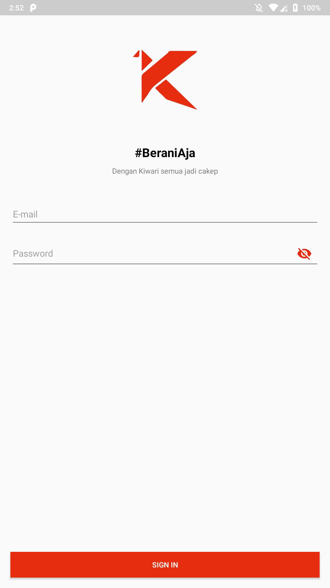

# Kiwari 
Simple One to One chat app backed by Firebase Realtime DB built in Kotlin.

## Screenshots

  
  

## Demo User
email: jarjit@mail.com
password: 123456

email: ismail@mail.com
password: 123456

## Libraries used:
1. [Firebase Authentication](https://firebase.google.com/docs/auth/)
2. [Firebase Realtime Database](https://firebase.google.com/docs/database/)
3. [Firebase Cloud Storage](https://firebase.google.com/docs/storage/)
4. [Glide](https://github.com/bumptech/glide/)
